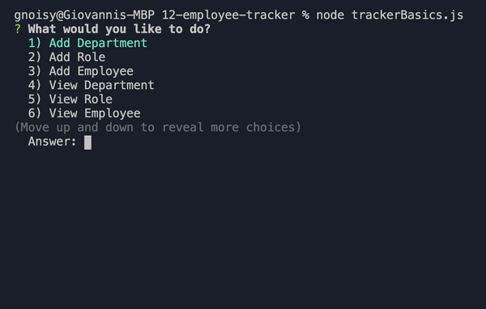
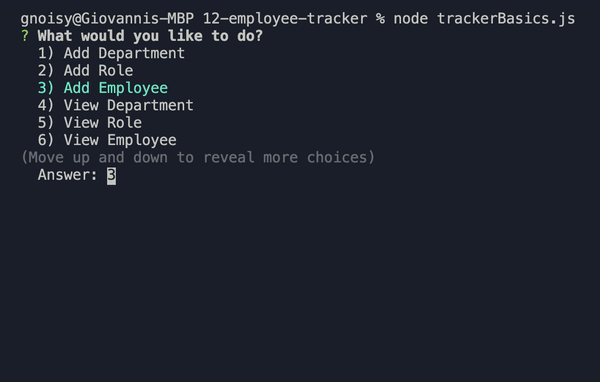
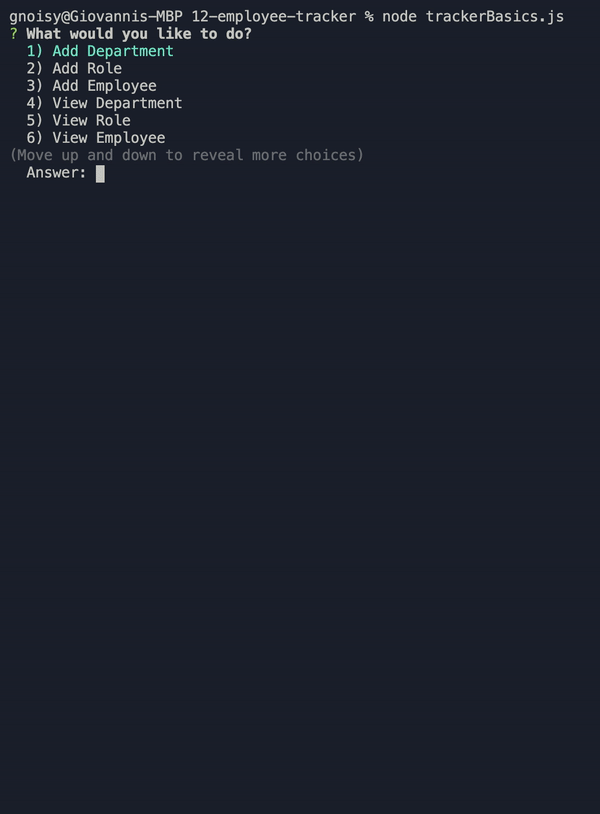

# 12-employee-tracker

This is an application that allows the user to manage a companies employee database using node, inquirer, and MySQL.


```
This screeshot shows the user being prompted for department and role.
```


```
This screeshot shows the user being prompted to add employee.
```


```
This screeshot shows the view department, view role and view employee tables.
```


## Deployed Link

* [See Live Site](https://gnoisy.github.io/12-employee-tracker/)

## Prerequisites

You'll need an IDE such as VS Code or Atom. Copy and paste code into your IDE and you can save file to your local drive.

```
https://code.visualstudio.com/download

https://flight-manual.atom.io/getting-started/sections/installing-atom/
```

## Installing

- Clone the repository : https://github.com/GNoisy/12-employee-tracker


## Built With

* [Javascript](https://developer.mozilla.org/en-US/docs/Web/JavaScript)
* [Node.js](https://nodejs.org/en/)
* [Inquirer.js](https://www.npmjs.com/package/inquirer#questions)
* [MySQL](https://www.mysql.com/)


## Author

* **Giovanni Noisy**

- [Github](https://github.com/GNoisy)
- [LinkedIn](https://www.linkedin.com/in/giovanni-noisy-04098989/)

### Acknowledgments

* MDN 
* w3schools